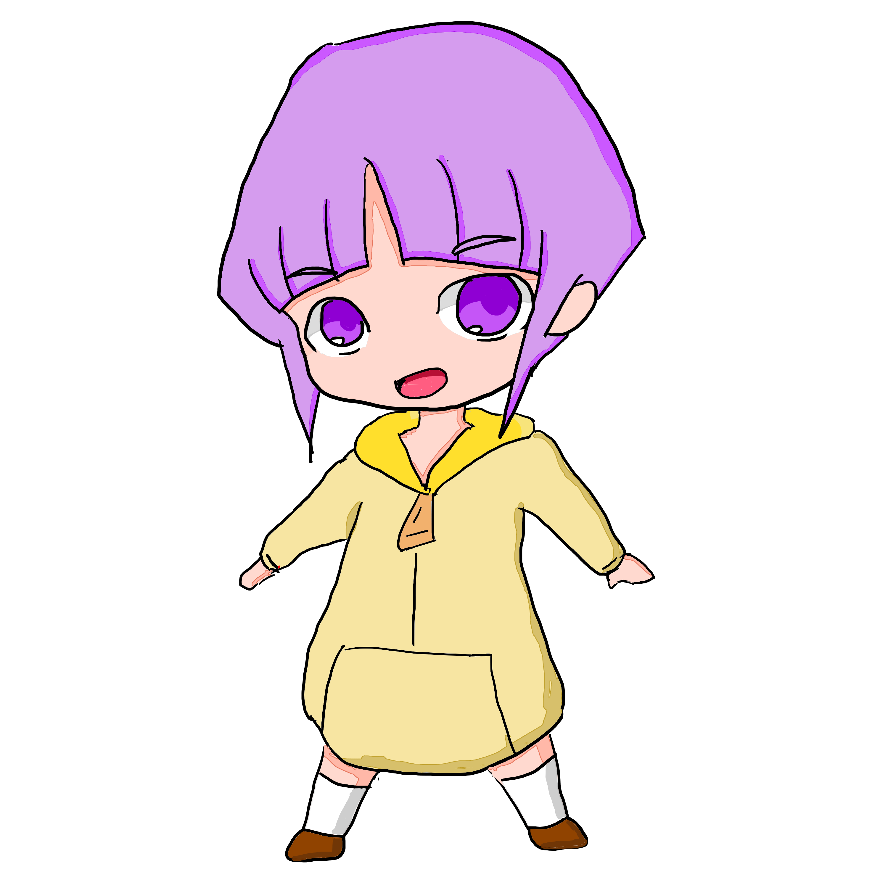
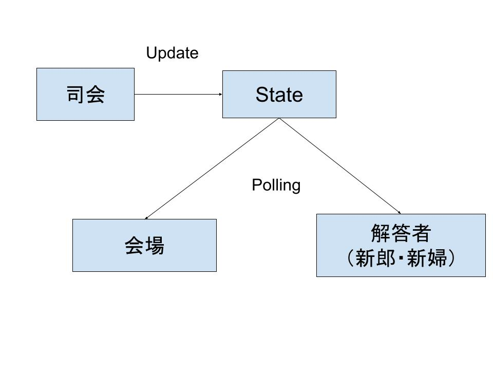

# 結婚式のクイズアプリを自作した話

---

## 自己紹介

- ufoo68([@ufoo_yuta](https://twitter.com/ufoo_yuta))
- [Flipdesk](https://flipdesk.jp/)
- AWS, Next.js, Nest.js, TypeORM
- 滋賀県在住

---

## 今回のテーマ

- 結婚式の披露宴向けのアプリをWEBで作ってみた
  - 以心伝心ゲーム
  - 全員参加型クイズ

---

## 以心伝心ゲームとは

- 解答者みんなの答えを揃えるゲーム
- 例
  - お題「カレーといえば？」
  - 「辛口」「甘口」というバラバラの回答だった場合は✕
  - 揃えば◯

---

## 以心伝心画面仕様

---

## 以心伝心要件

- 会場・司会・回答者の画面がある
- 会場の画面の表示を司会者画面が管理
- 解答者画面は手書き入力で回答
- ◯・✕は司会者が判断

---

## 以心伝心設計方針

- DBでStateをUpdateしてそれを書く画面で共有する形を採用

---

## 手書き入力で使ったもの

[react-signature-canvas](https://www.npmjs.com/package/react-signature-canvas)

---

## 全員参加型クイズ

---

## クイズ画面仕様

---

## クイズ要件

- 管理画面でクイズを編集できる
- 司会者画面で問題を進行
- 回答画面では選択と並べ替えの操作ができる

---

## 並べ替えで使ったもの

[dnd kit](https://dndkit.com/)

---

## 全体で使用した技術など

- [PlanetScale](https://planetscale.com/)
  - MySQLのクライドサービス。無料枠が使える。
- [t3-app](https://create.t3.gg/)
  - [Next.js](https://nextjs.org/)
  - [tRPC](https://trpc.io/)
  - [Prisma](https://www.prisma.io/)
  - [Tailwind CSS](https://tailwindcss.com/)
  - [NextAuth.js](https://next-auth.js.org/)

---

## DEMO（時間の許す限り）

ちなみにアプリは↓で公開してます

----

## 本番（披露宴）運用をしてみて

- 他の式準備の兼ね合いでエラーハンドリングをおざなりにしていた
  - 披露宴会場のネットワーク問題が発生した
  - 回答が送信できない場合に、ネットワークエラーなのかアプリケーションバグなのかの判断がつきにくかった
- 参加者が途中でブラウザを閉じてしまったときの救済処置がなかった
  - URLパラメータに参加者IDを保存していたので、ブラウザ履歴からたどれば復旧はできるのだがその導線を用意してなかった
  - ブラウザ内でのストレージを使うなどを今後は検討
